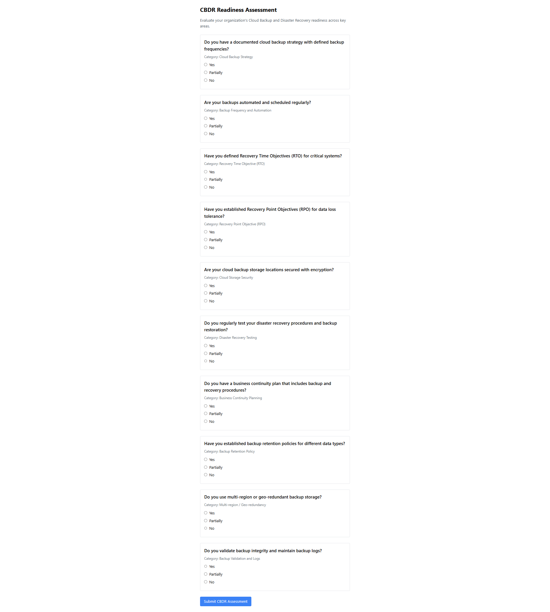
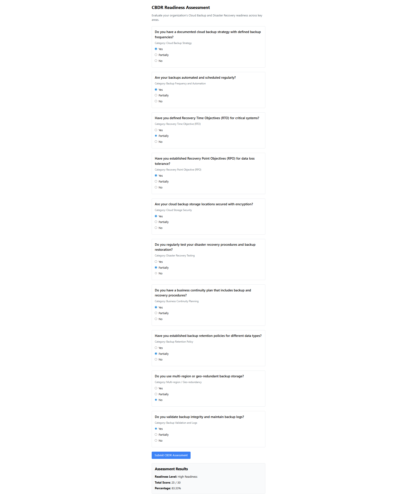

# Cloud Backup and Disaster Recovery (CBDR) Readiness Assessment Tool

## Project Overview

The Cloud Backup and Disaster Recovery (CBDR) Readiness Assessment Tool is an academic prototype designed to evaluate organizational preparedness for backup and recovery operations in cloud environments. The tool presents a structured assessment covering ten critical CBDR domains, including backup strategy, recovery objectives, disaster recovery testing, and business continuity planning.

This tool is designed for educational institutions and business organizations seeking to assess their current cloud backup and disaster recovery maturity. It provides immediate feedback on readiness levels and identifies areas requiring improvement.

## Features Implemented

### Frontend
- React-based assessment form with 10 CBDR-focused questions
- Dynamic form validation ensuring all questions are answered
- Real-time answer collection using radio button inputs
- Loading states and error handling for API interactions
- Results display showing readiness level, total score, and percentage

### Backend
- Express.js RESTful API with scoring endpoint (`/api/cbdr-score`)
- Dynamic readiness level computation based on assessment responses
- Scoring algorithm mapping answers to numerical values (Yes: 3, Partially: 2, No: 1)
- Readiness level classification:
  - High Readiness: 80-100%
  - Moderate Readiness: 50-79%
  - Low Readiness: Below 50%

### Integration
- Frontend-backend communication via fetch API
- CORS-enabled for cross-origin requests
- JSON-based data exchange between client and server

## Getting Started

### Prerequisites
- Node.js (v16 or higher)
- npm package manager

### Installation

1. Clone the repository:
```bash
git clone <repository-url>
cd cbdr-tool
```

2. Install backend dependencies:
```bash
cd backend
npm install
```

3. Install frontend dependencies:
```bash
cd ../frontend
npm install
```

### Running the Application

1. Start the backend server:
```bash
cd backend
node server.js
```
The backend server will run on `http://localhost:5000`

2. Start the frontend development server (in a new terminal):
```bash
cd frontend
npm run dev
```
The frontend will be available at `http://localhost:5173` (or the port specified by Vite)

3. Access the application:
Open your browser and navigate to the frontend URL (typically `http://localhost:5173`)

### Testing the API

You can test the scoring endpoint using curl:

```bash
curl -X POST http://localhost:5000/api/cbdr-score \
  -H "Content-Type: application/json" \
  -d '{"answers": ["Yes", "Partially", "No", "Yes", "Yes", "Partially", "Yes", "No", "Yes", "Partially"]}'
```

Expected response:
```json
{
  "totalScore": 22,
  "percentage": 73.33,
  "readinessLevel": "Moderate Readiness"
}
```

## Screenshots





## Project Structure

```
cbdr-tool/
├── backend/
│   ├── controllers/
│   │   └── scoreController.js      # Scoring logic and API handlers
│   ├── routes/
│   │   └── scoreRoutes.js         # API route definitions
│   ├── models/
│   │   └── questionModel.js        # Database schema (placeholder)
│   ├── data/
│   │   └── sampleQuestions.json    # Question definitions
│   └── server.js                   # Express server entry point
├── frontend/
│   ├── public/
│   │   └── index.html              # HTML template
│   ├── src/
│   │   ├── components/             # React components
│   │   ├── App.jsx                 # Main application component
│   │   └── main.jsx                # React entry point
│   ├── package.json                # Frontend dependencies
│   └── vite.config.js              # Vite configuration
├── screenshots/                    # Application screenshots
├── .env.example                    # Environment variables template
└── README.md                       # Project documentation
```

## Roadmap / Upcoming Features

### Phase 2: Database Integration
- Azure Cosmos DB integration for storing assessment sessions
- Response persistence and historical tracking
- User session management

### Phase 3: Reporting and Export
- PDF report generation with detailed findings
- CSV export functionality for data analysis
- Assessment history and comparison features

### Phase 4: Deployment
- Azure App Service deployment configuration
- Production environment setup
- CI/CD pipeline implementation

### Phase 5: Advanced Scoring
- NIST CSF framework mapping
- IRAT-inspired scoring matrix implementation
- Category-specific scoring algorithms
- Detailed recommendations based on assessment results

## License

This project is licensed under the MIT License.

## Disclaimer

This tool is an academic prototype intended for educational and evaluation purposes only. It does not represent a production-ready security assessment solution. For comprehensive cloud backup and disaster recovery assessments, organizations should consult with qualified cybersecurity and disaster recovery professionals.

The assessment results provided by this tool are based on self-reported responses and should be used as a starting point for further evaluation rather than definitive readiness determinations. 